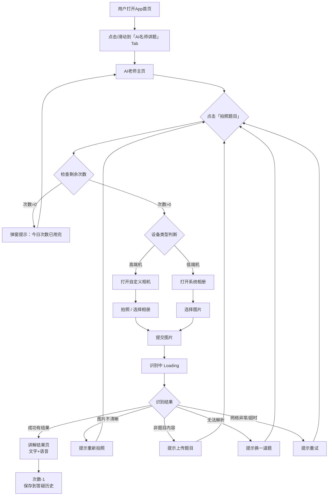
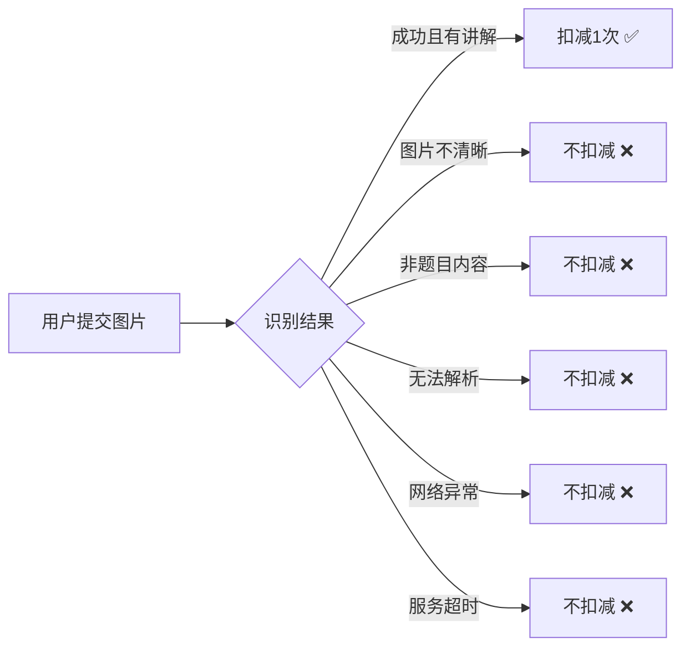

# AI名师讲题

## 📋 项目信息

| 字段 | 内容 |
|------|------|
| **产品名称** | XX学生端App |
| **需求名称** | AI名师讲题 |
| **文档负责人** | |
| **所属模块** | 课后 |
| **优先级** | P0 |
| **预计上线日期** | |
| **关联文档** | [设计稿链接]() / [数据看板]() |

---

## 📝 版本记录

| 日期 | 版本号 | 修改内容 | 修改人 |
|------|--------|----------|--------|
| 2025-03-05 | V1.0 | 初稿 | |

---

## 📑 目录

1. [需求背景](#一需求背景)
2. [需求目标](#二需求目标)
3. [需求概述](#三需求概述)
4. [详细方案](#四详细方案)
5. [流程图](#五流程图)
6. [异常与边界处理](#六异常与边界处理)
7. [数据埋点](#七数据埋点)
8. [上线计划与灰度策略](#八上线计划与灰度策略)

---

## 一、需求背景

### 1.1 现状问题

公司现有一款中价位引流课产品（定价几百元），此类课程在市场上同质化严重，竞争激烈。目前的课程包内容仅包含课程本身，缺少差异化的增值服务，导致在获客转化时缺乏竞争优势。

### 1.2 业务目标

通过在课程包中增加「AI名师讲题」功能，为用户提供**拍照上传题目 → AI个性化讲解**的增值服务，提升课程包的竞争力和用户感知价值，进而：
- 提升引流课的**转化率**
- 提升用户对产品的**粘性和使用频次**
- 为高价正价课提供**续报转化抓手**

### 1.3 用户价值

- **学生**：作业遇到不会的题，随时拍照获得个性化讲解，相当于随身携带一位AI老师
- **家长**：无需自己辅导，降低辅导焦虑，提升对产品的信任感

---

## 二、需求目标

| 目标类型 | 描述 | 衡量指标 | 目标值 |
|----------|------|----------|--------|
| 核心目标 | 为引流课提供差异化增值服务 | 功能渗透率（DAU中使用AI讲题的占比） | 待定 |
| 核心目标 | 提升用户粘性 | 人均使用次数/日 | 待定 |
| 次要目标 | 促进续报转化 | 使用AI讲题用户的续报率 vs 未使用用户 | 待定 |

---

## 三、需求概述

| 序号 | 功能模块 | 功能点 | 优先级 | 面向端 | 状态 |
|------|----------|--------|--------|--------|------|
| 1 | 入口 | 首页新增「AI名师讲题」Tab | P0 | 学生端 | 新增 |
| 2 | AI老师主页 | 老师形象展示 + 拍照入口 | P0 | 学生端 | 新增 |
| 3 | AI老师主页 | 切换AI老师 | P1 | 学生端 | 新增 |
| 4 | 拍照/上传 | 相机拍照（高端机） | P0 | 学生端 | 新增 |
| 5 | 拍照/上传 | 相册上传（全机型） | P0 | 学生端 | 新增 |
| 6 | 拍照/上传 | 低端机差异化设计 | P0 | 学生端 | 新增 |
| 7 | 题目识别 | 图片识别 + 异常处理 | P0 | 学生端 | 新增 |
| 8 | 讲解结果 | 文字解析 + 语音讲解 | P0 | 学生端 | 新增 |
| 9 | 答疑历史 | 历史记录查看 | P1 | 学生端 | 新增 |
| 10 | 使用限制 | 每日5次免费额度 | P0 | 学生端 | 新增 |

---

## 四、详细方案

### 4.1 首页Tab入口

#### 交互设计

> 📸 在App首页顶部Tab栏中，新增「AI名师讲题」Tab，位于「精选」和「AI名师课」之间。

#### 功能说明

1. **位置**：首页顶部Tab栏，排列顺序为：精选 | **AI名师讲题** | AI名师课
2. **交互**：
   - 点击Tab或左右滑动均可切换到该页面
   - 选中态显示绿色下划线指示器
3. **默认态**：用户打开App首页默认定位在「精选」Tab，不自动跳转到AI名师讲题

---

### 4.2 AI老师主页

#### 交互设计

> 📸 主页核心区域展示当前AI老师形象（头像+名字+风格标签），下方为拍照按钮和答疑历史入口。

#### 功能说明

1. **页面布局**（从上到下）：
   - **答疑历史入口**：右上角悬浮按钮，点击进入答疑历史页
   - **AI老师形象区**：圆形头像框（大尺寸居中） + 头像右下角🔄切换按钮
   - **老师信息**：老师名字（如"你好！我是秦瑜老师"） + 风格标签（如"生动活泼风格，她来帮你讲解"）
   - **拍照按钮**：绿色大按钮「📷 拍照题目」，占页面宽度约80%
   - **今日剩余次数**：按钮下方显示"今日剩余 X/5 次"

2. **老师信息展示规则**：
   - 首次进入默认展示第一位AI老师
   - 用户切换过老师后，记忆用户选择，下次进入展示上次选择的老师

---

### 4.3 切换AI老师

#### 交互设计

> 📸 点击老师头像右下角的🔄按钮，弹出老师选择面板。

#### 功能说明

1. **触发方式**：点击AI老师头像右下角的🔄按钮
2. **展示形式**：底部弹出半屏面板，展示所有可选AI老师列表
3. **老师卡片信息**：
   - 老师头像
   - 老师名字
   - 风格标签（如"生动活泼"、"耐心细致"、"逻辑严谨"）
   - 当前选中老师显示选中态（绿色边框/勾选标记）
4. **交互逻辑**：
   - 点击某位老师 → 主页老师形象立即切换
   - 切换后关闭面板
   - **记忆用户选择**：下次进入页面仍展示上次选择的老师
5. **老师数据来源**：后端配置，支持动态增减老师

---

### 4.4 拍照/相册上传

#### 交互设计

> 📸 点击「拍照题目」按钮后，根据设备类型进入不同流程。

#### 功能说明

##### 4.4.1 次数校验（前置检查）

1. 点击「拍照题目」按钮时，先检查当日剩余次数
2. **次数充足**（>0次）：正常进入拍照/相册流程
3. **次数用完**（=0次）：弹出提示弹窗
   - 标题："今日次数已用完"
   - 内容："每天可免费使用5次AI名师讲题，明天再来吧！"
   - 按钮："我知道了"
   - 点击按钮关闭弹窗，留在当前页

##### 4.4.2 高端机流程

1. 点击「拍照题目」→ 唤起**自定义相机页面**
2. 相机页面元素：
   - **取景框**：中央矩形取景区域，带虚线边框引导对准题目
   - **拍照引导文案**：取景框上方显示"请将题目对准框内，保持清晰"
   - **拍照按钮**：底部中央圆形快门按钮
   - **相册入口**：快门按钮左侧，点击打开系统相册
   - **闪光灯按钮**：顶部，支持开/关/自动切换
   - **关闭按钮**：左上角，点击返回AI老师主页
3. **拍照后**：
   - 显示拍照预览页
   - 底部两个按钮："重新拍照" / "使用照片"
   - 点击"使用照片"→ 进入题目识别流程（4.5节）

##### 4.4.3 低端机流程

1. **低端机判定**：使用已有设备分级逻辑
2. 点击「拍照题目」→ **直接打开系统相册**，不唤起相机
3. 用户从相册选择图片后 → 进入题目识别流程（4.5节）
4. **提示文案**：在AI老师主页的拍照按钮文案调整为「📷 上传题目」，下方增加灰色小字提示"当前设备建议从相册上传图片"

##### 4.4.4 相册上传（通用）

1. 高端机相机页左下角点击相册入口 / 低端机直接打开相册
2. 仅支持选择**单张图片**
3. 支持格式：JPG、PNG、HEIC
4. 图片大小限制：不超过20MB
5. 选择图片后 → 进入题目识别流程（4.5节）

---

### 4.5 题目识别

#### 交互设计

> 📸 用户提交图片后，进入识别中间态，根据识别结果展示不同页面。

#### 功能说明

##### 4.5.1 识别中（Loading态）

1. 提交图片后显示识别loading页面
2. 页面展示：
   - AI老师头像（缩小版）
   - 动态loading动画
   - 文案："老师正在看题中..."（可随机轮换趣味文案）
3. **超时处理**：若识别超过15秒未返回结果，进入超时状态

##### 4.5.2 识别成功 — 有结果

1. 识别出题目且有解析 → 进入讲解结果页（4.6节）
2. 扣减1次使用次数

##### 4.5.3 识别成功 — 无结果

1. 识别出题目内容但无法提供解析（如超出学科范围、题目过于复杂等）
2. 页面展示：
   - AI老师头像 + 抱歉表情
   - 文案："抱歉，这道题老师暂时还不会，换一道试试吧！"
   - 按钮："重新拍照" / "返回首页"
3. **不扣减使用次数**

##### 4.5.4 识别失败 — 图片不清晰

1. 图片模糊、光线过暗/过曝、题目不完整等
2. 页面展示：
   - AI老师头像 + 疑惑表情
   - 文案："图片不太清晰，老师看不清题目哦"
   - 引导提示："请确保题目完整、光线充足、文字清晰"
   - 按钮："重新拍照" / "从相册选择"
3. **不扣减使用次数**

##### 4.5.5 识别失败 — 非题目内容

1. 上传的图片不是题目（如自拍、风景照等）
2. 页面展示：
   - AI老师头像 + 无奈表情
   - 文案："这似乎不是一道题目哦，请拍一道题试试吧！"
   - 按钮："重新拍照" / "从相册选择"
3. **不扣减使用次数**

##### 4.5.6 识别失败 — 网络异常

1. 网络不可用或请求失败
2. 页面展示：
   - 通用网络错误图标
   - 文案："网络不太好，请检查网络后重试"
   - 按钮："重试" / "返回首页"
3. **不扣减使用次数**

##### 4.5.7 识别失败 — 服务超时

1. 请求超过15秒未响应
2. 页面展示：
   - AI老师头像 + 抱歉表情
   - 文案："等了太久了，老师思考超时了，再试一次吧"
   - 按钮："重试" / "返回首页"
3. **重试逻辑**：点击"重试"使用同一张图片重新请求，无需重新拍照
4. **不扣减使用次数**

> [!IMPORTANT]
> ⚠️ 仅「识别成功且有结果」时扣减使用次数，其他所有异常场景均不扣减。

---

### 4.6 讲解结果展示

#### 交互设计

> 📸 识别成功后展示讲解结果页，包含题目原图、文字解析和语音讲解。

#### 功能说明

1. **页面布局**（从上到下）：
   - **顶部导航栏**：左箭头返回 + 标题"AI讲解"
   - **题目原图区**：展示用户上传的题目图片（可点击放大查看）
   - **学科标签**：自动识别显示学科标签（数学/语文/英语）
   - **文字解析区**：
     - 标题："解题思路"
     - AI生成的文字解析内容，支持数学公式渲染
     - 分步骤展示解题过程（步骤1、步骤2...）
   - **语音讲解区**：
     - AI老师头像（小）+ 老师名字
     - 音频播放条：播放/暂停按钮 + 进度条 + 时间
     - 以当前选择的AI老师声音进行讲解
   - **底部操作栏**：
     - "再拍一题"按钮 → 返回相机/相册
     - "分享"按钮 → 生成分享卡片（可选）

2. **语音讲解规则**：
   - 进入结果页**不自动播放**语音，需用户手动点击播放
   - 语音内容与文字解析一致，以当前老师风格口吻讲解
   - 退出页面自动停止播放

3. **数据保存**：
   - 讲解结果自动保存到答疑历史
   - 保存内容：题目图片 + 文字解析 + 语音文件 + 学科 + 老师 + 时间

---

### 4.7 答疑历史

#### 交互设计

> 📸 从AI老师主页右上角「答疑历史」入口进入，展示历史讲解记录列表。

#### 功能说明

1. **入口**：AI老师主页右上角「🕐 答疑历史」按钮
2. **列表页展示**：
   - 按时间倒序排列
   - 每条记录展示：题目图片缩略图 + 学科标签 + 讲解老师名 + 时间
   - 点击某条记录 → 进入讲解结果详情页（同4.6节）
3. **分页加载**：每页20条，上拉加载更多
4. **空态**：
   - 图标 + 文案："还没有答疑记录哦，去拍一道题试试吧！"
   - 按钮："去拍照" → 返回AI老师主页
5. **历史保留时长**：保留最近90天的记录
6. **删除**：支持左滑删除单条记录，删除后不可恢复

---

### 4.8 每日次数限制

#### 功能说明

1. **免费额度**：每位用户每日可免费使用5次
2. **次数重置**：每日00:00自动重置
3. **次数展示**：
   - AI老师主页拍照按钮下方显示"今日剩余 X/5 次"
   - 每次成功讲解后，实时更新剩余次数
4. **次数用完**：
   - 拍照按钮仍可点击，点击后弹出次数用完提示（见4.4.1节）
   - 按钮样式变为灰色/置灰态
5. **扣减规则**：仅「识别成功且返回讲解结果」时扣减，异常场景不扣减

---

## 五、流程图

### 5.1 用户操作主流程

### 5.2 次数扣减逻辑

---

## 六、异常与边界处理

| 序号 | 异常场景 | 处理方案 | 兜底策略 |
|------|----------|----------|----------|
| 1 | 网络断连 | 提示检查网络，提供重试按钮 | 已识别的历史记录可离线查看 |
| 2 | 识别接口超时（>15秒） | 提示超时，支持用原图重试 | 最多重试2次，仍失败则提示稍后再试 |
| 3 | 图片不清晰 | 提示重新拍照/选择，给出拍照引导 | 不扣减次数 |
| 4 | 非题目图片 | 友好提示上传题目图片 | 不扣减次数 |
| 5 | 不支持的学科 | 提示"暂不支持该学科" | 不扣减次数 |
| 6 | 低端机相机崩溃 | 低端机不唤起相机，仅支持相册上传 | 已在4.4.3节做差异化设计 |
| 7 | 图片格式不支持 | 提示"请上传JPG/PNG格式图片" | 相册选择时做格式过滤 |
| 8 | 图片过大（>20MB） | 提示"图片过大，请重新选择" | 可考虑自动压缩 |
| 9 | 语音播放失败 | 下方提示"语音加载失败"，文字解析正常展示 | 文字解析为主，语音为辅 |
| 10 | 老师列表加载失败 | 展示默认老师，不影响核心拍照功能 | 缓存上次加载的老师列表 |
| 11 | 次数统计异常 | 以服务端为准，客户端展示可能有延迟 | 服务端做兜底校验 |
| 12 | 公式渲染异常 | 部分复杂公式可能显示异常 | 降级为纯文本展示 |

---

## 七、数据埋点

| 序号 | 埋点名 | 触发时机/交互 | 埋点位置 | 埋点类型 | 参数名 | 参数类型 | 参数值 | 备注 |
|------|--------|---------------|----------|----------|--------|----------|--------|------|
| 1 | ai_tab_click | 点击「AI名师讲题」Tab | 展示 | 点击 | courseId | int | 课程ID | |
| | | | | | lessonId | string | 课次ID | |
| | | | | | subId | int | 学科ID | |
| | | | | | grade_q | string | 年级 | |
| 2 | ai_teacher_page_show | AI老师主页展示 | 展示 | 曝光 | teacherId | string | 当前老师ID | |
| | | | | | teacherName | string | 老师名称 | |
| | | | | | remainCount | int | 剩余次数 | |
| 3 | ai_switch_teacher | 点击切换老师 | 点击 | 点击 | fromTeacherId | string | 切换前老师ID | |
| | | | | | toTeacherId | string | 切换后老师ID | |
| 4 | ai_photo_click | 点击「拍照题目」按钮 | 点击 | 点击 | deviceType | string | 高端机/低端机 | |
| | | | | | remainCount | int | 剩余次数 | |
| 5 | ai_photo_take | 拍照完成/选择图片完成 | 点击 | 点击 | source | string | camera/album | 来源（相机/相册） |
| | | | | | deviceType | string | 高端机/低端机 | |
| 6 | ai_recognize_result | 识别结果返回 | 展示 | 曝光 | resultType | string | success/unclear/not_question/no_result/network_error/timeout | 识别结果类型 |
| | | | | | duration | int | 识别耗时(ms) | |
| | | | | | subject | string | 学科 | 识别成功时 |
| 7 | ai_explain_show | 讲解结果页展示 | 展示 | 曝光 | teacherId | string | 老师ID | |
| | | | | | subject | string | 学科 | |
| 8 | ai_voice_play | 点击播放语音讲解 | 点击 | 点击 | teacherId | string | 老师ID | |
| | | | | | duration | int | 音频时长(s) | |
| 9 | ai_history_click | 点击「答疑历史」 | 点击 | 点击 | historyCount | int | 历史记录总数 | |
| 10 | ai_history_detail | 点击某条历史记录 | 点击 | 点击 | recordId | string | 记录ID | |
| | | | | | subject | string | 学科 | |
| 11 | ai_count_exhaust | 触发次数用完弹窗 | 展示 | 曝光 | | | | |
| 12 | ai_retake_click | 点击「重新拍照」 | 点击 | 点击 | fromPage | string | 来源页面 | |

> **通用参数说明**（以下参数每个埋点默认携带，无需重复列出）：
> - `courseId`: 课程ID (int)
> - `lessonId`: 课次ID (string)
> - `subId`: 学科ID (int)
> - `grade_q`: 年级

---

## 八、上线计划与灰度策略

### 8.1 上线节奏

| 阶段 | 时间 | 范围 | 关注指标 |
|------|------|------|----------|
| 灰度1期 | T+1周 | 5%流量 | 功能可用性、崩溃率、识别准确率 |
| 灰度2期 | T+2周 | 30%流量 | 功能渗透率、人均使用次数、识别成功率 |
| 全量发布 | T+3周 | 100% | 核心指标达标后全量 |

### 8.2 核心关注指标

- **识别成功率**：目标 ≥ 90%
- **次数用完比例**：观察5次/天是否合理
- **功能崩溃率**：特别关注低端机，目标 < 0.1%

### 8.3 回滚方案

- 通过服务端开关控制功能入口，可随时下线
- 灰度期间如出现大面积识别失败或崩溃，立即回滚至上一版本
- 回滚不影响已保存的答疑历史数据

---

## 📎 附录

- [设计稿地址]()
- [技术方案文档]()
- [测试用例]()
- [数据看板]()
